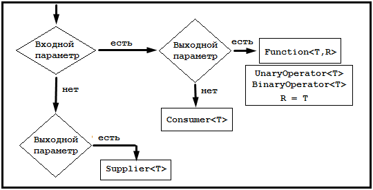

# Lesson 01: Lambda

## <a name="toc"></a> Содержание:
- [Интерфейсы](#Interface)
- [Default методы](#Default)
- [Функциональный интерфейс](#FunctionalInterface)
- [Встроенные реализации функциональных интерфейсов](#Embedded)
-- [Предикат](#Predicate)
-- [Consumer](#Consumer)
-- [BiConsumer](#BiConsumer)
-- [Supplier](#Supplier)
-- [Function](#Function)
-- [BiFunction](#BiFunction)
-- [Оператора (унарный, бинарный)](#Operators)
- [Method Reference](#MethodReference)
- [Дополнительные материалы](#Materials)

## <a name="Interface"></a> Interface
Испокон веков в Java используется такое средство языка, как интерфейс.
Если вспомнить, то интерфейс описывает контракт класса, который будет реализовывать данный интерфейс. То есть он определяет поведение класса.
В интерфейсах мы объявляем сигнатуры методов и не определяем их тело. Тем самым мы указываем какие методы будут, но не указываем, как они будут реализованы.

Модификатор доступа **методов** - **public**. Указать модификатор доступа ниже не получится ни у методов в интерфейсе, ни у классов, которые реализуют. Классы, которые реализуют данные методы, не могут уменьшить область видимости по правилам языка Java. В интерфейсе же области видимости по-умолчанию определены как public. Связано это как минимум с тем, что необходимо обеспечить целостность. Допустим, public интерфейс реализуют из другого пакета - что делать с protected или private методами?

Так же интерфейсы может содержать **поля**, и они будут все неявно **static final**.
Ссылка на вопрос на форуме: "[Why are all fields in an interface implicitly static and final?](https://stackoverflow.com/questions/1513520/why-are-all-fields-in-an-interface-implicitly-static-and-final)"

**Интересно, что:** в интерфейсе можно так же определить методы от Object. Естественно, метод будет определён по сигнатуре и будет выполнена проверка, что нет конфликтов с методами Object. Кроме того, любой объект будет по умолчанию реализовывать такой метод.

## <a name="Default"></a> Default методы (Java 8)
Начиная с Java 8 в интерфейсы добавляется возможность указывать реализации методов.
Выполнить это можно при помощи ключевого слово **default**.
Методы, помеченные как default, имеют модификатор доступа **public**.
Default методы имеют свою реализацию по-умолчанию, которая описана в интерфейсе, но могут быть переопределены в классах, реализующих интерфейс.

Так же методы в интерфейсах могут быть указана не как default, а как static.
Стоит учитывать, что вызов такого метода через класс, реализующий данный интерфейс, приведёт к ошибке: ```illegal static interface method call, the receiver expression should be replaced with the type qualifier```.

## <a name="FunctionalInterface"></a> Functional Interface
Так же в Java8 появилась особая аннотация - ```@FunctionalInterface```.
Данная аннотация говорит, что данный интерфейс является функциональным интерфейсом.
Чтобы интерфейс был корректным функциональным интерфейсом он должен удовлетворять следующим условиям:
- Иметь только 1 абстрактный метод
- Абстрактный метод не пересекается с методами Object
- Количество default и static методов не учитывается
Эти интерфейсы также известны как **Single Abstract Method interfaces (SAM interfaces)**.

Пример:
```java
@FunctionalInterface
public interface PrintFunction {
    void print(String text);
}
```
В старом стиле мы бы писали так:
```java
@Test
public void testAppHasAGreeting() {
	PrintFunction app = new PrintFunction() {
		@Override
			public void print(String text) {
				System.out.println(text);
			}
		};
	app.print("test");
}
```
Функциональные интерфейсы позволяют использовать **лямбда-выражения** для тех же целей:
```java
@Test
public void testAppHasAGreeting() {
	PrintFunction app = text -> System.out.println(text);
	app.print("test");
}
```
Синтаксис лямбда выражений очень прост.
Слева - параметры, справа - выражение.
Выражение может быть блоком кода:
```java
@Test
public void testAppHasAGreeting() {
	PrintFunction app = text -> {
		System.out.println(text.toLowerCase());
		System.out.println(text.toUpperCase());
	};
	app.print("TeSt");
}
```
Если бы наш метод принимал на вход 2 String значения, то наша лямбда бы тоже изменилась:
```java
PrintFunction app = (f, l) -> System.out.println(f + " " + l);
app.print("first", "last");
```

## <a name="Embedded"></a> Встроенные реализации функициональных интерфейсов
В Java есть набор готовых функиональных интерфейсов, у каждого из которых есть своя цель.


### <a name="Predicate"></a> Predicate
Предикаты (```Predicate<T>```) - интерфейс, описывающий некое утвреждение, которое можно проверить. На вход получает тип T, который и будет проверять.

Например, так может выглядеть проверка на нечётность:
```java
Predicate<Integer> odd = number -> number % 2 != 0;
System.out.println(odd.test(2)); // = false
```
```predicate.negate()``` позволяет так же получать инверсированный предикат:
```java
Predicate<Integer> odd = number -> number % 2 != 0;
System.out.println("Is Odd: " + odd.test(2)); // false
System.out.println("Is Even: " + odd.negate().test(2)); // true
```
Предикаты можно объединять в цепочки через ```predicate.and``` и ```predicate.or```:
```java
Predicate<Integer> odd = number -> number % 2 != 0;
System.out.println(odd.and(number -> number > 1).test(3));
```
Как видно, второй предикат реализован при помощи лямбды. Потому что предикат - функциональный интерфейс.

### <a name="Consumer"></a> Consumer
Consumer (```Consumer<T>```) - интерфейс, описывающий некоего потребителя. Он получает на вход объект типа T и с ним выполняет какие-то действия, но не возвращает ничего.
Самый просто пример - вывод в консоль:
```java
Consumer<String> printer = text -> System.out.println(text);
printer.accept("Text");
```

### <a name="BiConsumer"></a> BiConsumer
BiConsumer (```BiConsumer<T, U>```) - Аналогичен Consumer, но принимает на вход 2 значения
```java
Map<Integer, String> map = new HashMap<>();
BiConsumer<Integer, String> con = (i, s) -> map.put(i, s);
con.accept(1, "item one");
con.accept(2, "item two");
System.out.println(map);
```

### <a name="Supplier"></a> Supplier
Supplier (```Suplier<T>```) - интерфейс, описывающий некоего поставщика. Он не принимает на вход ничего, но возвращает объект типа T.
Пример:
```java
Supplier<Integer> generator = () -> new Random().nextInt(100);
System.out.println(generator.get());
System.out.println(generator.get());
```
Так как у нас нет входных данных, то мы используем конструкцию ```() ->```

### <a name="Function"></a> Function
Function (```Function<T,R>```) - интерфейс, описывающий функцию.
На вход принимает объект типа T и возвращает объект типа R.
Простейшим примером является конвертер значений. Например:
```java
Function<String, Integer> converter = text -> Integer.valueOf(text);
System.out.println(converter.apply("2").compareTo(2)); // 0 = equals
```

### <a name="BiFunction"></a> BiFunction
BiFunction (```BiFunction<T, U, R>```) - функция, которая принимает на вход 2 параметра типов T и U и возвращает значение типа R.
```java
BiFunction<Integer, Long, String> summator = (a, b) -> "Value: " + (a + b);
System.out.println(summator.apply(10, 100L));
```

### <a name="Operators"></a> Operators
Так же добавлены такие функциональные интерфейсы как:
- UnaryOperator
- BinaryOperator
Подробнее: [https://www.concretepage.com/java/jdk-8/java-8-unaryoperator-binaryoperator-example](Java 8 UnaryOperator and BinaryOperator).

Если кратко, то вот разница между ними:
```java
UnaryOperator<Integer> incrementor = e -> ++e;
System.out.println(incrementor.apply(2)); // 3

BinaryOperator<Integer> stepIncrementor = (e,s) -> e + s;
System.out.println(stepIncrementor.apply(2,3)); // 5
```
Унарная операция - один аргумент - Function
Бинарная операция - два аргумента - BiFunction
Можно сказать, что это более краткая запись функций.
Так же у **BinaryOperator**'а есть интересная возможность:
```java
BinaryOperator<Integer> getMax = BinaryOperator.minBy(Comparator.reverseOrder());
BinaryOperator<Integer> getMin = BinaryOperator.minBy(Comparator.naturalOrder());
System.out.println("Max is: " + getMax.apply(2, 5));
System.out.println("Min is: " + getMin.apply(3, 7));
```

## <a name="MethodReference"></a> Method Reference
В Java8 так же добавились Method Reference.
Они позволяют сохранить ссылку на метод в более коротком формате:
```java
// Lambda позволяет указать реализацию
PrintFunction func = text -> System.out.println(text);
// Method Reference позволяет сохранить ссылку на вызов
PrintFunction printer = func::print;
// Вызывает метод print по ссылке из printer
printer.print("test");
```
В данном примере видна разница, но нет смысла у Method Reference. Более осмысленный пример можно увидеть ниже:
```java
Supplier<Date> dateFactory = Date::new;
System.out.println(dateFactory.get());
```
Данный Supplier предоставляет Date.
**ВАЖНО**: Чтобы использовать MethodReference - метод должен подходить под известные функциональные интерфейсы. Стандартные функциональные интерфейсы не предполагают использование более чем 2 входных параметров. Если нужно использовать больше - необходимо создать свой функциональный интерфейс.

## <a name="Materials"></a> Дополнительный материал
Видео доклады:
[Сергей Куксенко : JDK8: Я, лямбда](https://www.youtube.com/watch?v=8S759EYnjFU)

[Сергей Куксенко : Молот лямбд](https://www.youtube.com/watch?v=JjLYhPGH3QA)

Обзор:
[Functional Interfaces in Java 8](http://www.baeldung.com/java-8-functional-interfaces)

[Функциональные интерфейсы в Java 8](https://javanerd.ru/основы-java/функциональные-интерфейсы-в-java-8)